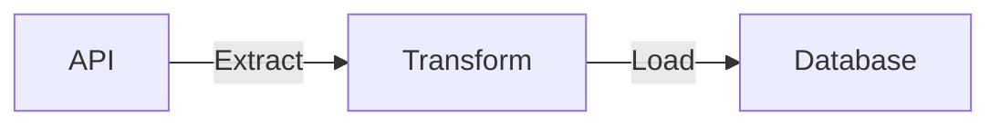

## Project design

We pull data from Reddit/Twitter API, transform them using python and load them into a database.

## Prerequisites

1. [Python3](https://www.python.org/downloads/)
2. [sqlite3](https://www.sqlite.org/download.html) (comes preinstalled on most os)
3. [Reddit app](https://www.geeksforgeeks.org/how-to-get-client_id-and-client_secret-for-python-reddit-api-registration/). You'll need your reddit apps **`REDDIT_CLIENT_ID, REDDIT_CLIENT_SECRET, & REDDIT_USER_AGENT`**.
4. [Twitter API token](https://developer.twitter.com/en/docs/twitter-api/getting-started/getting-access-to-the-twitter-api), you'll need your twitter APIs **`BEARER_TOKEN`**.
5. [git](https://git-scm.com/book/en/v2/Getting-Started-Installing-Git)

